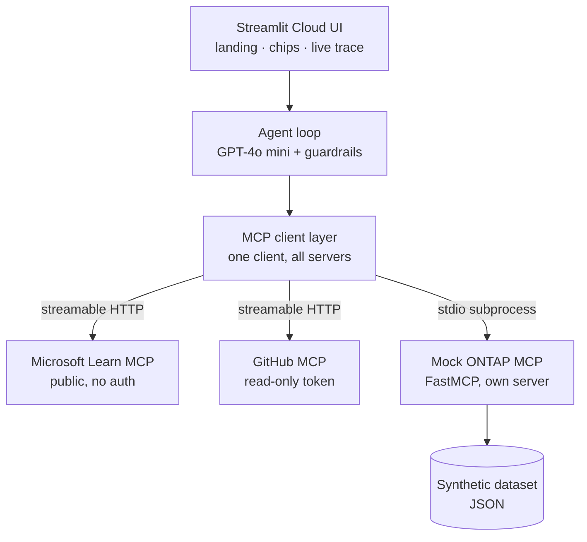
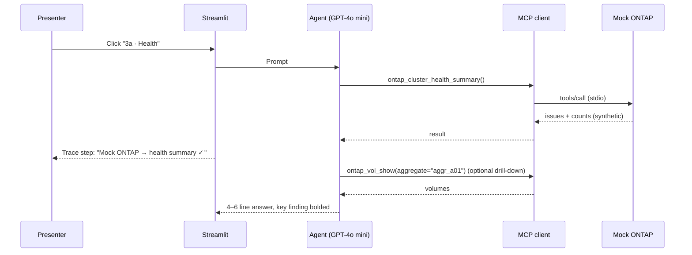

# MCP Live Demo — Design

> Companion docs: `plan.md` (why and when) · `spec.md` (what exactly to build)

## 1. Architecture overview



Everything runs inside **one Streamlit Cloud app**. The only outbound calls are to OpenAI, Microsoft Learn, and GitHub. The ONTAP server lives in the same container as a child process.

## 2. Components

### 2.1 Streamlit UI
- Owns presentation only: landing panel, sidebar, chips, chat, trace, closing card.
- Holds conversation history and the tool-call log in `st.session_state`.
- Calls the agent with the user message and a callback for streaming trace events.

### 2.2 Agent loop
- Sends messages plus MCP tool schemas to GPT-4o mini.
- When the model returns tool calls, routes each through the MCP client, appends results, and loops (max 6 iterations).
- Emits trace events (`tool_started`, `tool_finished`, `tool_failed`) for the UI.
- Holds the system prompt (stored as a separate text file so it can be tuned without code changes).

### 2.3 MCP client layer
- A single client configured with all three servers (FastMCP's client supports a multi-server config).
- Tool names are namespaced per server so the model and trace show where each tool lives (e.g., `ontap_…`, `learn_…`, `github_…`).
- Tool list is fetched once at startup and cached for the sidebar and the model's tool definitions.
- **Session lifetime:** open the client per user turn, not across Streamlit reruns. Streamlit reruns the script on every interaction, so long-lived async sessions in session state are fragile.

### 2.4 Mock ONTAP MCP server
- FastMCP, Python, stdio transport.
- Loads the synthetic JSON once at start; all tools are pure reads over that data.
- `ontap_vol_resize` computes a plan and never writes back.
- Tool annotations mark every tool read-only; the resize tool is described as "plans a resize (dry run)".
- Actionable errors: unknown names return close matches; bad change numbers explain the format.

## 3. Key flows

### 3.1 Health check (chip 3a)



### 3.2 Guarded change (chips 3b → 3c)
1. **3b:** the model recognises a change request with no change number and asks for one. Per the system prompt, no tool call is made. If the model does call `ontap_vol_resize` without `change_id`, the tool refuses anyway (defence in depth).
2. **3c:** the model calls `ontap_vol_resize(volume="vol_payments_db", grow_by_gb=200, change_id="CHG0012345")`.
3. The tool returns `status: dry_run`, the projection (~92%), and the warning that suggests `aggr_a02`.
4. The answer states clearly that nothing was executed.

This is the demo's key moment: **the guardrail lives in the tool, not just the prompt.**

## 4. UI design

### 4.1 Layout

```
┌──────────────────────┬──────────────────────────────────────────────┐
│ SIDEBAR              │ MAIN                                         │
│                      │                                              │
│ Connected systems    │ [Landing panel — before first message]       │
│ ● Microsoft Learn  3 │   "One AI assistant, three systems,          │
│ ● GitHub          12 │    one universal connector."                 │
│ ● Mock ONTAP       4 │   [Learn card] [GitHub card] [ONTAP card]    │
│                      │              [ Start demo ]                  │
│ Model: GPT-4o mini   │                                              │
│                      │ [Chat messages]                              │
│ ┌──────────────────┐ │   answer (4–6 lines, key number bold)        │
│ │ Demo data —      │ │   ▸ Tool trace (3 steps)                     │
│ │ no real systems  │ │                                              │
│ └──────────────────┘ │ [1·Docs][2·GitHub][3a·Health][3b·Resize]     │
│                      │ [3c·Approve][Wrap up]                        │
│ ▸ Presenter          │ [ chat input ........................ ]      │
│   Replay mode ☐      │                                              │
│   Reset demo         │                                              │
└──────────────────────┴──────────────────────────────────────────────┘
```

### 4.2 Visual principles
- **Readable over pretty:** wide layout, large base font, short answers.
- **Show work, hide plumbing:** trace steps are one-liners while running; raw JSON only in an expander and only when presenter mode is off.
- **Consistent server colours:** public servers in one colour, the ONTAP server in an accent colour, used in the sidebar, trace steps, and landing cards.
- **Status first:** green/red dots for server connectivity; trace steps show ✓ or ✗ with duration.

### 4.3 Trace step format
`Mock ONTAP → ontap_aggr_show · 0.3 s ✓`

Expanded view (presenter mode off): arguments, then the first ~20 lines of the result.

## 5. State and data

| Item | Where | Lifetime |
|---|---|---|
| Chat history | `st.session_state.messages` | Until Reset |
| Tool-call log | `st.session_state.trace` | Until Reset |
| Cached tool list | `st.cache_resource` | App process |
| Synthetic dataset | ONTAP server memory | Server process |
| Replay recordings | JSON files in repo (`replay/`) | Committed |
| Secrets | Streamlit secrets | Deployment |

## 6. Error handling and replay

| Failure | Behaviour |
|---|---|
| MCP server unreachable at start | Sidebar dot red; tools from that server excluded; app continues |
| Tool call error | Trace shows ✗ with a short reason; agent continues with other data |
| OpenAI 5xx / 429 / timeout | One retry, then a friendly message plus a "Show recorded answer" button |
| Replay mode on | Chips return recorded answer and trace; trace steps are replayed with short delays to feel live |

**Recording replays:** a presenter-only "Record" action saves the last chip's answer and trace to `replay/<chip>.json`. Re-record after any prompt change.

## 7. Repository layout

```
mcp-demo/
├── app.py                     # Streamlit entry point (UI only)
├── agent/
│   ├── loop.py                # agent loop, trace events
│   ├── mcp_clients.py         # multi-server MCP client config
│   └── system_prompt.md       # tunable prompt
├── ontap_mock/
│   ├── server.py              # FastMCP server, 4 tools + 1 resource
│   └── data/estate.json       # synthetic dataset (spec.md §3)
├── replay/                    # recorded chip responses
├── ui/
│   ├── landing.py
│   ├── sidebar.py
│   └── closing_card.py
├── requirements.txt
├── README.md                  # includes "all data is synthetic"
└── .streamlit/config.toml     # theme, wide layout
```

## 8. Security and compliance design

- **Synthetic only:** no real hostnames, IPs, names, or data from any employer environment. A README statement and an in-app badge make this explicit.
- **Least privilege:** GitHub PAT is fine-grained, read-only, and scoped to one public demo repo.
- **No write paths:** the only "write" tool is a planner; the dataset is never modified.
- **Secrets:** Streamlit secrets only; the repo includes `.streamlit/secrets.toml` in `.gitignore`.
- **Cost control:** spend cap on the OpenAI account.

## 9. Extensibility (phase 2 hooks)

| Extension | Design hook |
|---|---|
| Real ONTAP cluster | Replace the data layer in `ontap_mock/server.py` with ONTAP REST calls; tool names, inputs, and output shapes stay the same |
| Claude Haiku 4.5 fallback | Add a provider adapter behind the agent loop; keep conversation history in a neutral format; MCP tool schemas are already JSON Schema |
| Remote ONTAP server | Switch the FastMCP transport from stdio to streamable HTTP and deploy to Cloud Run; the app's client config changes from "launch command" to "URL" |
| Evaluations | Add 10 read-only questions with verifiable answers over the synthetic dataset for regression testing |
